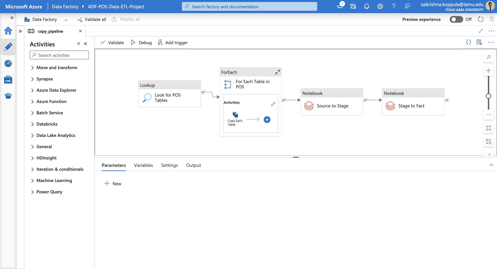

Now that we have our source and target databases setup, let us first see how to connect them.

## Connecting On-Prem SQL Server to Azure Data Factory

Since ADF does not inherently connect to on-premises databases, we’ll use **Integration Runtime (IR)** to create this connection. **SHIR (Self Hosted INtegration Runtime)** is a software component that has to be installed on a machine within your on-premises network and enables secure data transfer between your on-premises data source. However, we have to configure it using our Azure cloud to ensure secure connection. To do this, we utilize a Linked Service in Azure Data Factory.

We will follow the below steps to connect the on-premises database and ADF using Integration Runtime.

- Go to the Manage tab in ADF Studio and select Integration Runtimes.
- Choose New to add a new integration runtime. Select Self-hosted Integration Runtime (SHIR) since our data source is on-premises.
- Name your IR and choose Create.
- For this project, we are using the Express setup to install SHIR directly on machine.
- Once downloaded, we run the setup to install and register SHIR on the hosting system, enabling communication between ADF and our local database.
- To confirm the setup, open Microsoft Integration Runtime on your system. It should show as Connected to the ADF environment.

Now that our databases are connected, Our next step is to configure a data pipeline that will move data from source to target.

## Configuring the Data Ingestion Pipeline

1. In the ADF **Author** tab, select **Pipelines** and create a new pipeline. Name it "CopyPipeline" to represent the copy operation.
2. Add a **Copy Data** activity to the pipeline. This activity will pull data from the on-premises SQL Server.
3. We need to specify the source and target/destination for the pipeline.

### Specifying Source and Sink:

#### Source:

* In the Copy Data activity, navigate to **Source** and select **New Dataset** .
  
* Choose **SQL Server** as the dataset type, and connect it to your on-premises SQL Server using **Linked Services** .
* Create a **New Linked Service** to define the connection properties:
  * Select **SHIR** as the Integration Runtime.
  
  * Enter the server name and the database name from SQL Server Management Studio.
  * For authentication, we have stored the credentilas in our Azure Key Vault resource and we will use it here. For accessing those credentials, create a new linked service for the key voault that allows communication between ADF and Azure Key Vault.
  
* Now, ADF will be able to connect to on-prem SQL Server database with the help of these 2 linked services.

#### Sink:

* In the Copy Data activity, navigate to **Sink**.
  
* **Sink** is sourcelayer container in our **sddatalakegen2** resource.
* Create Azure Data Lake Storage Linked Service (**AzureDataLakeStorage1**). Use AutoResolveIntegrationRuntime as the resource is cloud based. Specify file path, source container as shown in the below figure.
  
* Publish all these changes to ADF, and now, we have all services needed for data ingestion.

### Defining the Data Pipeline
We have setup the source and sink for our pipeline. Now let us define the actions of the pipeline. Below is a screenshot for how our pipeline will look like.

Our pipeline will have a look up activity that will intially read the names of all the tables in a given database. Once the list of tables is available, this list will be passed to the next activity in the pipline i.e for each activity. This activity will perform a series of steps for each table in the list passed by the previous activity.

The activities inside for each task can be seen below.

This for each activity is used to copy all tables from the source to the target database.

The source and the sink for this task can be found in the below screenshots.

The data ingestion part of the pipeline is complete with these 2 activities.

By running the pipline that we built till now, we should be able to replicate an exact copy of all the tables present in the POS Schema on the On-Prem SQL Server. These tables are stored on the target database in the form of parquet files in the **sourcelayer** container as shown below.

As per our project structure, we have 3 main layers. Source Layer, Stage Layer and Fact Layer. Companies typically try to maintain the same project structure for all ETL projects. To ensure we do the same thing, we have created a separate folder for our database inside source layer. Similarly, if we had more databases, they can have a separate folder too, categorizing them into different folders while maitaining consistency in the structure.