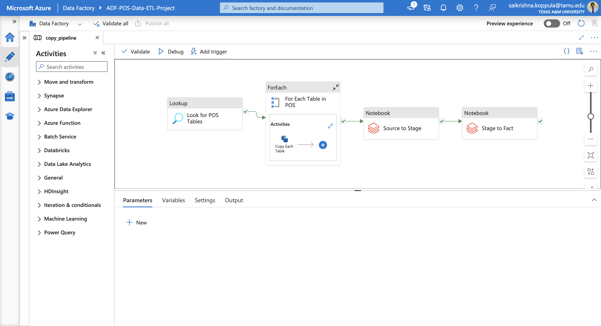

In this part of the project, we will use Azure Databricks to make transformations to our data while moving it from source layer to stage layer and stage layer to fact layer containers in Azure Data Lake.

By the end of Data Ingestion, I was able to have a set of parquet files in the source layer that were the exact copy of tables in the On-Prem database. Now, I will load this files into databricks and perform required transformation on data and then store it back in a different layer. To make the required transformations, I need to follow the below steps.

## Creating the Azure Databricks Compute Workspace

Go to **Databricks reource > Create Compute** .

* Create a Single node cluster
* **Enable credential passthrough for user-level data access** under Advanced options for Key Vault access. This is needed because we cannot give managed identity level access to databricks resource for accessing data in data lake. By enabling this option, databricks will leverage the user-level data access permission to read data from data lake.
* To read data from data lake, we first need to create mount points in Databricks File System. We can do so by following the instructions given in this link: [Access Azure Data Lake Storage using Microsoft Entra ID (formerly Azure Active Directory) credential passthrough (legacy) - Azure Databricks](https://learn.microsoft.com/en-us/azure/databricks/data-governance/credential-passthrough/adls-passthrough#--azure-data-lake-storage-gen2-1)
* The same is accomplished in [Storage Mount Notebook](./Storage%20Mount%20Notebook.ipynb)

## Perform data transformation

Some specific data transformations are perfomed in each layer of movement. These ytransformation can be anything with respect to requirements like, Type Conversion, Caluclations, Table Joins, Business Logic Improvements, etc,.

The specific transformations performed for this project can be found in [Source to Stage Notebook](./Source_to_Satge.ipynb) & [Stage to Fact Notebook](./Stage_to_Fact.ipynb) respectively.

## Adding data transformation notebooks to Azure Data Factory pipeline

* Create an access token in Azure Databricks by going to **User Settings > Developer** .
* Add the generated access token to Key Vault
* Create a linked service in Azure Data Factory to connect to Azure Databricks workspace using the created access token
* Now we can add two activities to our previous **copy_all_tables** pipeline to transform data in sourcelayer container and move it into factlayer container. These activities were present in the pipline screenshot shown before. The same can be seen below as well.

  
