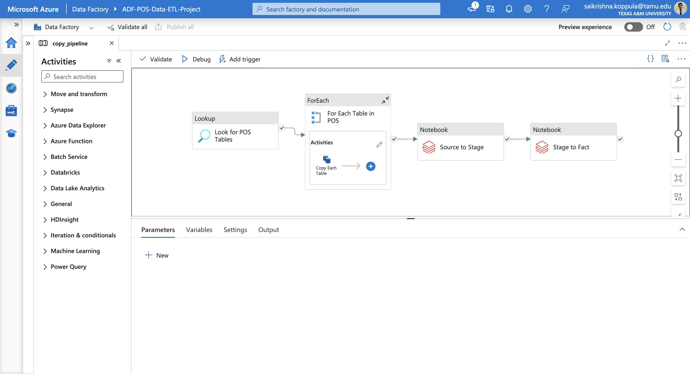

# Transforming Data with Azure Databricks

In this part of the project, I used **Azure Databricks** to perform transformations on the data while moving it from the **source layer** to the **stage layer** and then from the **stage layer** to the **fact layer** in **Azure Data Lake**.

By the end of the Data Ingestion phase, I had a set of **parquet files** in the source layer, which were an exact copy of the tables in the on-premises database. Now, I loaded these files into Databricks to perform the required transformations and stored the transformed data in a different layer. The transformation process involved several key steps outlined below.

---

## Creating the Azure Databricks Compute Workspace

1. Navigate to **Databricks resource > Create Compute**.
   
2. **Create a Single Node Cluster**:
   - Enable **credential passthrough for user-level data access** under **Advanced options** for Key Vault access.
   - Since managed identity access cannot be granted directly to the Databricks resource, enabling this option allows Databricks to leverage user-level data access permissions to read from the data lake.

3. **Set Up Mount Points**:
   - To read data from Azure Data Lake, I created mount points in the **Databricks File System (DBFS)**.
   - Followed instructions in this link to enable credential passthrough and set up the mount points: [Access Azure Data Lake Storage using Microsoft Entra ID (formerly Azure Active Directory) credential passthrough (legacy) - Azure Databricks](https://learn.microsoft.com/en-us/azure/databricks/data-governance/credential-passthrough/adls-passthrough#--azure-data-lake-storage-gen2-1)
   - The mount setup process is documented in the [Storage Mount Notebook](./Storage%20Mount%20Notebook.ipynb).

---

## Performing Data Transformations

I performed specific data transformations as the data moved between layers. These transformations included various operations, such as type conversions, calculations, table joins, and business logic improvements based on project requirements.

- The specific transformations performed for this project are documented in two notebooks:
  - [Source to Stage Notebook](./Source_to_Satge.ipynb)
  - [Stage to Fact Notebook](./Stage_to_Fact.ipynb)

P.S: You will be able to see only partial part of the code as all the transformations could not be made public. Please reach out to me if you would like to understand what kind of transformations I made for this project.

---

## Adding Data Transformation Notebooks to Azure Data Factory Pipeline

1. **Generate an Access Token** in Azure Databricks:
   - Go to **User Settings > Developer** and create an access token.
   
2. **Store Access Token in Key Vault**:
   - Add the generated access token to **Azure Key Vault**.

3. **Create a Linked Service in Azure Data Factory**:
   - Set up a linked service to connect Azure Data Factory to the Azure Databricks workspace using the access token stored in the Key Vault.

4. **Add Transformation Activities to the Pipeline**:
   - I added two activities to the previously created **copy_all_tables** pipeline to transform data in the `sourcelayer` container and move it into the `factlayer` container.
   - These activities can be seen in the pipeline screenshot below:

     

   - The entire pipeline in now read and I will show you a pictiure of it running successfully.

      

      

After running the pipeline successfully, the data is now cleaned and stored in the **fact layer** of the data lake. The next step involves loading this data into a database.